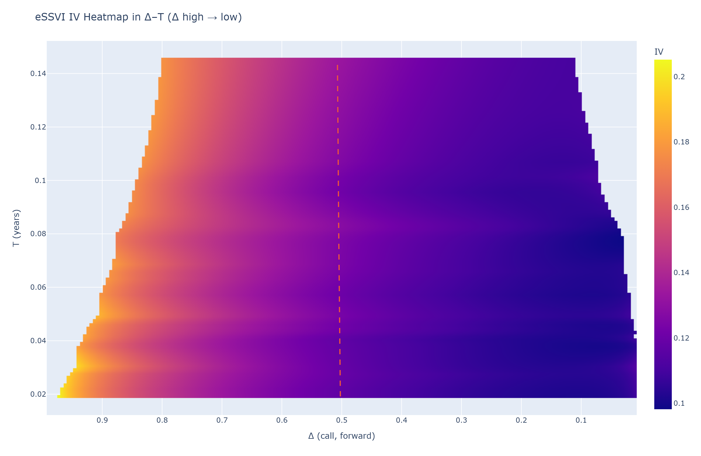

TL;DR

What: Real-time eSSVI fit on SPX option snapshots (Polygon vendor IV + Yahoo spot).

Why it’s good: Low fit error — current run shows mean absolute IV error ≈ 30 bps across short tenors (7–60 DTE).

Proof: See plots in plots/ — model vs vendor IV is tight; residuals are centered and small; per-expiry MAE is stable.

Run Snapshot (Artifacts in plots/)

Filenames include timestamps; yours may differ by a few digits. These are from the latest run you shared.

Fit quality & diagnostics

plots/model_vs_vendor_iv_20250915_132003.png — model IV vs vendor IV (1:1 line).

plots/residual_hist_bp_20250915_132003.png — residual histogram (bp); thin tails, mean |err| ≈ 30 bp.

plots/mae_by_expiry_bp_20250915_132003.png — per-expiry MAE (bp).

Term-structure parameters

plots/theta_vs_T_20250915_132003.png — θ(T) (ATM total variance).

plots/rho_vs_T_20250915_132003.png — ρ(T) (skew).

plots/psi_vs_T_20250915_132003.png — ψ(T) (shape).

plots/phi_vs_T_20250915_132003.png — φ(T) = ψ/√θ (normalized shape).

Surfaces & heatmaps (interactive + static)

plots/eSSVI_surface_20250915_132310.html (interactive total-variance/IV toggle)
plots/eSSVI_surface_IV_20250915_132310.png (preview)

plots/iv_heatmap_delta_T_20250915_132515.html — Δ–T IV heatmap (ATM ridge overlaid)
plots/iv_heatmap_delta_T_20250915_132515.png

plots/iv_surface_delta_T_20250915_132958.html — 3D IV surface in Δ–T
plots/iv_surface_delta_T_20250915_132958.png

Risk-reversal / Butterfly

plots/rrbf_25d_table_20250915_132515.csv & .md — 25Δ RR and BF vs T.

plots/rrbf_lines_20250915_132515.html & .png — lines for RR25, BF25, and ATM IV.

Tip: link a few images directly in the README for recruiters:

 

Method (what’s happening under the hood)

Data:

Vendor IVs from Polygon option snapshots for I:SPX.

Spot S_yahoo from Yahoo ^GSPC (Polygon snapshot used only to set strike filter window).

Strike filter (“previous filter”): keep strikes in 
0.95
,
1.05
0.95,1.05 × S_ref, with S_ref = Polygon snapshot if available else Yahoo.

Tenor window: fit 7–60 DTE (short tenors where eSSVI is most informative for trading).

Targets: use vendor IVs directly; compute k = ln(K / S_yahoo).

Trims: cap |k| ≤ 0.50; require ≥20 points per expiry to keep it.

Fit: eSSVI with smoothness regularization across expiries; soft enforcement of the Gatheral–Jacquier bound.

Weights: emphasize liquid/near-ATM points via vendor vega, |k| proximity, and open interest.

Diagnostics: MAE in IV (bp), per-expiry MAE, residual distribution; parameter curves θ/ρ/ψ/φ; Δ–T visuals; 25Δ RR & BF.

Why the MAE matters

≈30 bp mean absolute error in IV is tight for short-dated SPX chains using live vendor quotes.

Small, centered residuals → the surface is usable for RR/BF, delta-space comparisons, and relative-value reads (e.g., call-wing richening).

Reproduce (2 lines)
pip install -r requirements.txt
# Put POLYGON_API_KEY in .env (see .env.example), then open notebooks/real_time_fit.ipynb and Run All

Optional CLI: python -m src.realtime_essvi.run_notebook (executes the notebook via nbconvert; saves all plots under plots/).

Caveats

Vendor IVs are snapshots; microstructure noise and crossed markets can exist near the touch.

Using Yahoo for k keeps moneyness consistent even if Polygon snapshot is briefly stale; we still gate strikes by the snapshot via S_ref.

For wider wings or lower liquidity, relax K_ABS_CAP and the strike window, but watch calendar/butterfly sanity.
