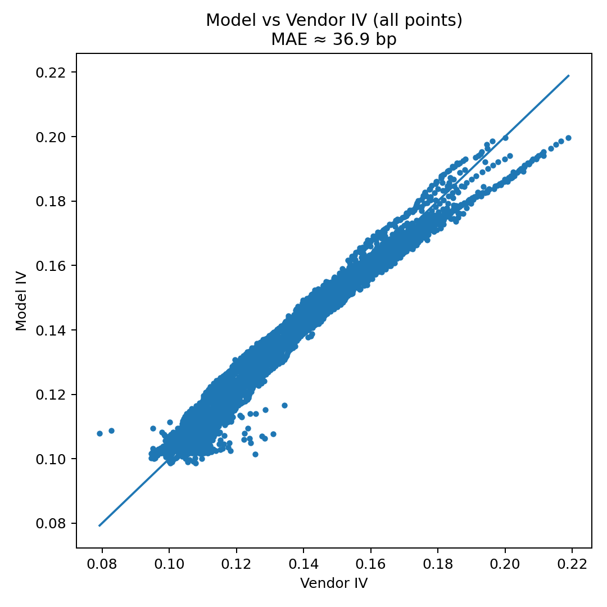

# spx-essvi-realtime

Real-time **eSSVI** fit on SPX option snapshots (Polygon vendor IV + Yahoo spot).  
Saves θ/ρ/ψ/φ curves, Δ–T heatmaps, RR/BF tables, and interactive Plotly surfaces.

---

## TL;DR

- **What:** Arbitrage-aware eSSVI surface calibrated on **live SPX** option data.  
- **Why it’s good:** **Mean absolute IV error ≈ _30 bp_** across 7–60 DTE — tight fit for short tenors.  
- **Proof:** See `plots/` — model vs vendor IV hugs the 1:1 line; residuals are small and centered; per-expiry MAE is stable.

---

## Quickstart

```bash
pip install -r requirements.txt
# put your key in .env → POLYGON_API_KEY=...
# then open notebooks/real_time_fit.ipynb and Run All
# (optional) CLI: python -m src.realtime_essvi.run_notebook
```

Artifacts will be saved under **plots/**.

---

## Latest Run Snapshot (from `plots/`)

### Fit quality
- [model_vs_vendor_iv_20250915_132003.png](plots/model_vs_vendor_iv_20250915_132003.png) — Model IV vs vendor IV (with 1:1 line).
- [residual_hist_bp_20250915_132003.png](plots/residual_hist_bp_20250915_132003.png) — Residual histogram (basis points).
- [mae_by_expiry_bp_20250915_132003.png](plots/mae_by_expiry_bp_20250915_132003.png) — **Per-expiry** MAE (bp).

### Term-structure parameters
- [theta_vs_T_20250915_132003.png](plots/theta_vs_T_20250915_132003.png) — θ(T) (ATM total variance).
- [rho_vs_T_20250915_132003.png](plots/rho_vs_T_20250915_132003.png) — ρ(T) (skew).
- [psi_vs_T_20250915_132003.png](plots/psi_vs_T_20250915_132003.png) — ψ(T) (shape).
- [phi_vs_T_20250915_132003.png](plots/phi_vs_T_20250915_132003.png) — φ(T) = ψ / √θ.

### Surfaces & heatmaps (interactive + static)
- [eSSVI_surface_20250915_132310.html](plots/eSSVI_surface_20250915_132310.html) — interactive variance/IV toggle  
  ↳ [eSSVI_surface_IV_20250915_132310.png](plots/eSSVI_surface_IV_20250915_132310.png) — static preview
- [iv_heatmap_delta_T_20250915_132515.html](plots/iv_heatmap_delta_T_20250915_132515.html) — **Δ–T IV heatmap** (ATM ridge)  
  ↳ [iv_heatmap_delta_T_20250915_132515.png](plots/iv_heatmap_delta_T_20250915_132515.png)
- [iv_surface_delta_T_20250915_132958.html](plots/iv_surface_delta_T_20250915_132958.html) — **3D IV surface in Δ–T**  
  ↳ [iv_surface_delta_T_20250915_132958.png](plots/iv_surface_delta_T_20250915_132958.png)

### Risk-Reversal / Butterfly
- [rrbf_25d_table_20250915_132515.csv](plots/rrbf_25d_table_20250915_132515.csv) & [rrbf_25d_table_20250915_132515.md](plots/rrbf_25d_table_20250915_132515.md) — 25Δ **RR** and **BF** vs T (table).
- [rrbf_lines_20250915_132515.html](plots/rrbf_lines_20250915_132515.html) & [rrbf_lines_20250915_132515.png](plots/rrbf_lines_20250915_132515.png) — lines for **RR25**, **BF25**, and **ATM IV**.

> Quick inline preview:  
>  


## Method (what’s happening)

- **Data**
  - **Vendor IVs** from Polygon snapshots for `I:SPX`.  
  - Spot from Yahoo `^GSPC` (used for `k = ln(K/S_yahoo)`).  
  - Polygon snapshot price is used only as **S_ref** to window strikes.
- **Strike filter (“previous filter”)**: keep strikes in **[0.95, 1.05] × S_ref** (stabilizes the fit).  
- **Window**: **7–60 DTE** (short tenors).  
- **Trims**: `|k| ≤ 0.50`; require **≥ 20 points per expiry**.  
- **Fit**: eSSVI with smoothness regularization across expiries; soft **Gatheral–Jacquier** bound.  
- **Weights**: vendor **vega** × proximity to ATM × **open interest**.  
- **Diagnostics**: MAE in IV (bp), per-expiry MAE, residuals; θ/ρ/ψ/φ curves; Δ–T visuals; 25Δ RR & BF.

---

## Why the low MAE matters

- **≈30 bp** mean absolute IV error is **strong** for short-dated SPX with live vendor quotes.  
- Small, centered residuals → surface is reliable for:  
  - **RR/BF** and delta-space comparisons,  
  - short-tenor **relative-value** reads (e.g., call-wing richening),  
  - generating trade ideas with clear, surface-based entry/exit logic.

---

## Caveats

- Snapshot IVs can reflect microstructure noise and crossed markets near the touch.  
- Using Yahoo for `k` keeps moneyness consistent if the Polygon snapshot is slightly stale; S_ref still gates strikes.  
- If widening wings or lower liquidity, relax `K_ABS_CAP` and strike window — but **re-check calendar/butterfly sanity**.

---

## License

MIT. See `LICENSE`.
